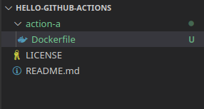
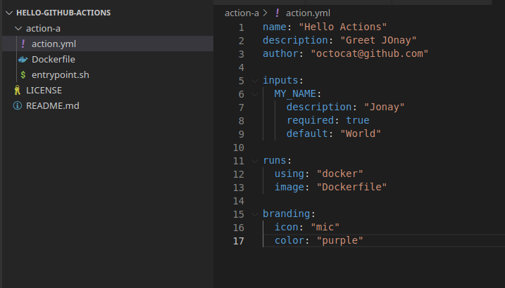
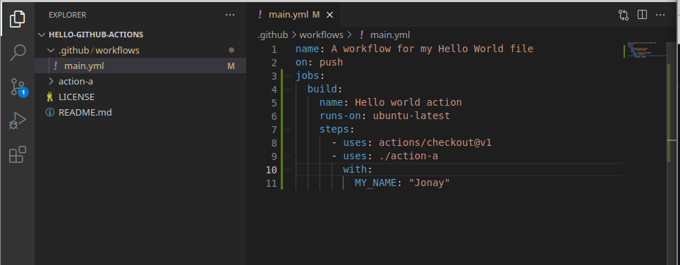
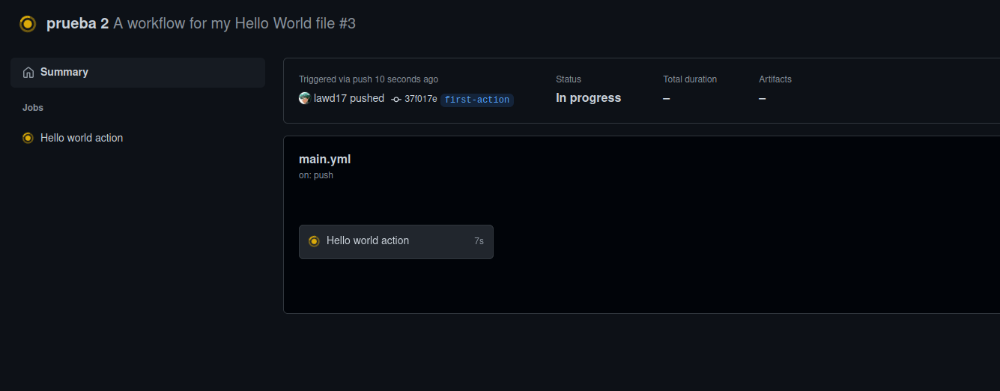
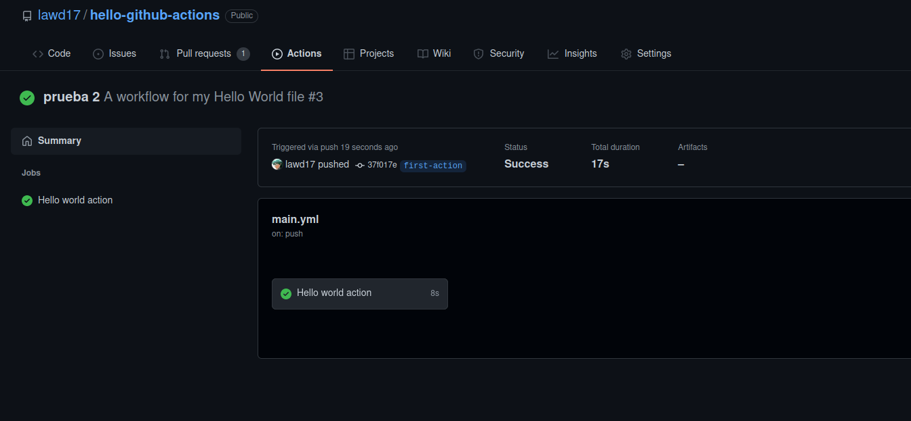
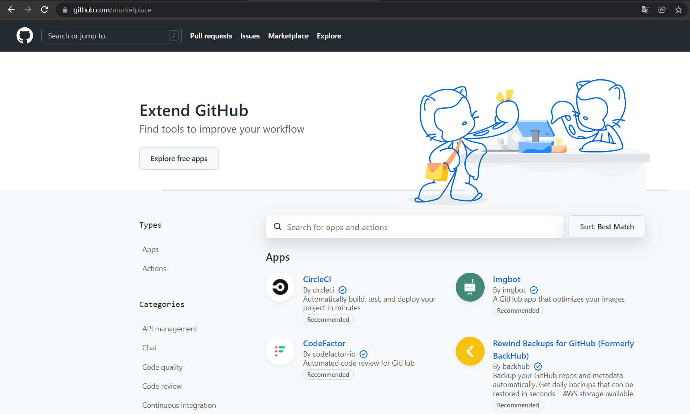
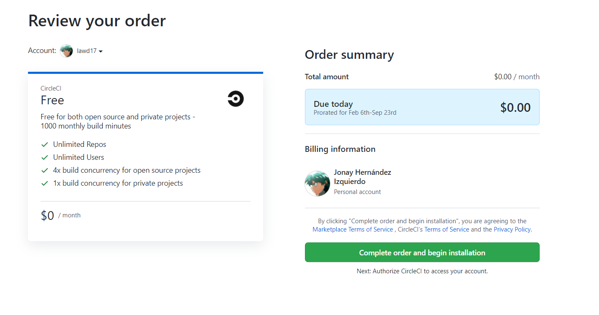
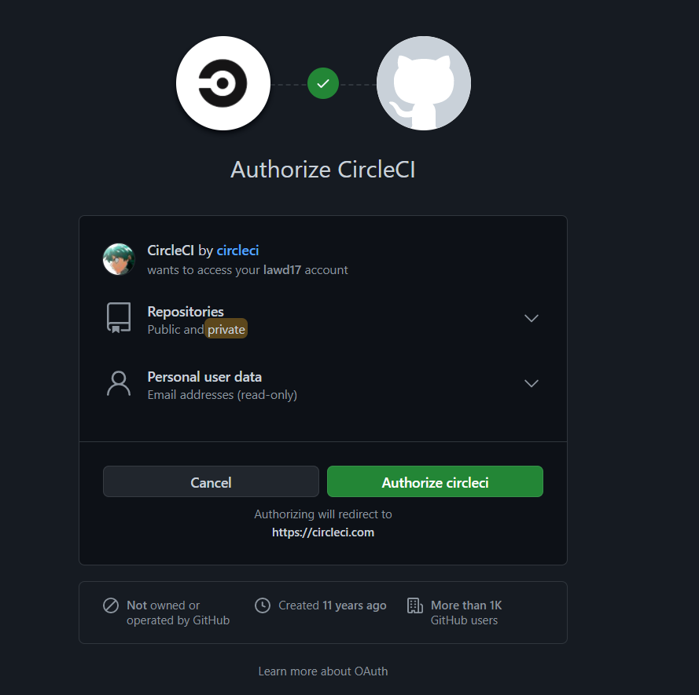

# GitHub CI/CD Marketplace

## 1. Introducción.
Es cierto que actualmente hay multitud de herramientas para poder automatizar tareas de integración y despliegue continuos, pero ninguna permite tenerlo integrado en tu propios software de repositorio de código.
Entonces aparece GitHub Actions, con esto podemos realizar todos las tareas de integración y despliegue, como son batería de test, comprobación del código o desplegar nuestra aplicación, todo desde GitHub.

Actions es una herramienta que nos ayuda a reducir los pasos necesarios para la ejecución de código, mediante la creación de un "workflow" encargado de realizar diferentes accion al producirse un cambio como puede ser "push", "merge" ó "pull", algo como una Pipelina en Jenkins. Nos permite crear workflows que se pueden utilizar para compilar, testear y desplegar código.

**¿Como puede hacer esto GitHub?**.\
Resulta que Actions usa paquetes de códigos en Docker, los cuales se lanzan en los servidores de GitHub que ademas son compatibles con cualquier lenguaje.

## 2. Continuous Integration ( CI ).
**¿Qué es la integración continua?**\
**"La integración continua CI/CD (continuous integration) es una práctica por la cual los desarrolladores integran o combinan el código en un repositorio común, facilitando la realización de test o pruebas para detectar y resolver posibles errores".**

Para implementar la integración continua en Github lo que se hace es crear uno o varios workflows que se lanzan cuando se realiza un "pull request" y si todos las comprobaciones son correctas se realiza la mezcla.

## 3. Continuous Deployment ( CD ).

**¿Qué es el despliegue continuo?**\
**"Con el despliegue continuo se va un paso más allá de la entrega continua, automatizando todo el proceso de entrega de software al usuario, eliminando la acción manual o intervención humana necesaria en la entrega continua.".**

No confundir con la entrega continua (continuous delivery).\
**"La entrega continua CI/CD (continuous delivery) está relacionada con la integración continua y consiste en la automatización del proceso de entrega del software, permitiendo que pueda ser implementado en producción de forma confiable y sencilla."**

Para implementar estas tareas en GitHub action realizamos workflows que se lancen una vez se acepta un pull request o se ha realizado un push.

## 4. Sintaxis.
Para realizar un pipelin o como lo denomina GitHub "Workflows" tenemos crear una carpeta en nuestro repositorio con el nombre ".github" y dentro otra carpeta denominada "workflow" con los ficheros ".yml" donde tendremos que definir los pasos de la pipeline. El fichero workflow trabaja en formta YAML el mismo que se usa para crear los fichero de Docker Compose.

Ejemplo

Puntos de sintaxis básica:
- "name": apartado opcional para el nombre del workflows.
- "on": especifica el evento que ejecutara el fichero, si quieres especificar rama hacer lo siguiente.

- "jobs": aquí se especifican los jobs que pueden ser uno o mas.
- "build": declaración del nombre del primer "jobs", este lina es obligatoria.
- "runs on": configura el workflow para que se ejecute en una una maquina virtual que se especifica, [mas opciones](https://docs.github.com/en/actions/using-workflows/workflow-syntax-for-github-actions#jobsjob_idruns-on).
- "steps": donde se especifica los pasos que se van a realizar, que pueden ser uno o varios.
- "name": nombre opcional del paso.
- "use": aquí descarga e instalar un versión especifica que la comunidad de github a preparado.
- "run": esta palabra le dice al job que es lo que tiene que ejecutar, en este caso se lanza maven.

## 5. Ejemplo.
Ahora se va a ver un ejemplo de Workflow de un "Hello World!!" muy básico.

Primero de todos creamos un nuevo repositorio en nuestro Github y en el añadimos la siguiente estructura. El README  y LICENSE son opcionales.

Ademas en nuestro caso esto se ha realizando en otra rama que hemos llamado:

Como se ve en la estructura, creamos un fichero Dockerfile. Este es un contenedor Debian al que se le va a añadir script, con una permisos de ejecución y la ultima linea localiza ese fichero en nuestra estructura para que lo pueda añadir.

Ahora vamos a crear el fichero entrypoint, que es un script que lanza el siguiente mensaje.

Como se ve en el comando, usa una variable que vamos a definir en un fichero "action.yml" que se va a crear en el directorio "action-a".

Lo mas importante de este fichero es el apartado "inputs" donde podemos ver la variable declarada.

Con esto realizado vamos a crear el Workflow, para ello creamos la capeta "workflows" y dentro el archivo yml.

Y ahora realizamos el push para ver como se arrancar el workflow.

Lanzado.

Si realizamos cambios y lanzamos otro push veremos que se vuelve a ejecutar.

Ejecutando.

Ejecutado.

Pestaña action con todas las tareas.

## 6. Marketplace.

El mercado Github contiene multitud de herramientas que te permiten añadir funcionalidades y mejoras a tu flujo de trabajo. Incluso podemos encontrar actions ya realizadas que podemos añadir a nuestros proyectos.

Aqui vemos el inicio de la tienda donde podemos seleccionar la herramienta o filtrar.

Ejemplo de descarga

Seleccionamos un herramienta.

Seleccionamos el plan.

Autorizamos la aplicación.

## Referencias
 - [Documentación oficial](https://docs.github.com/en/actions)
 - [Opciones de maquinas virtuales](https://docs.github.com/en/actions/using-workflows/workflow-syntax-for-github-actions#jobsjob_idruns-on)
 - [MarketPlace](https://github.com/marketplace?type=)
 - [Curso GitHub Actions](https://lab.github.com/githubtraining/github-actions:-hello-world)
 - [CI/CD con GitHub Actions](https://jorgehrj.medium.com/ci-cd-con-github-actions-66a7c325f45f)
 - [GitHub Actions Quickstart](https://docs.github.com/es/actions/quickstart)

